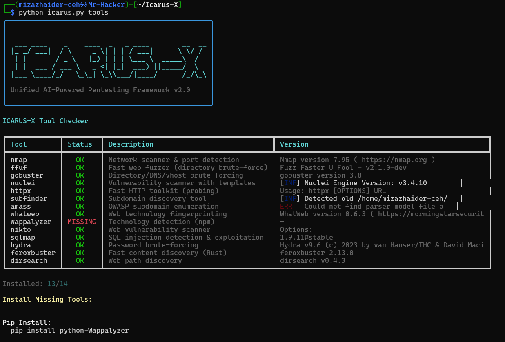
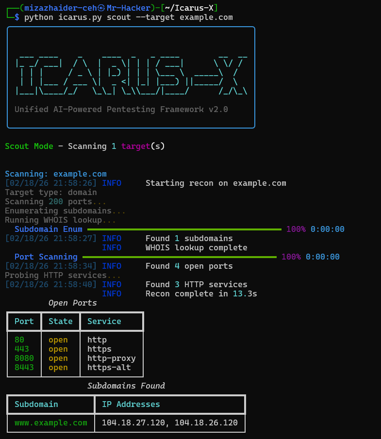
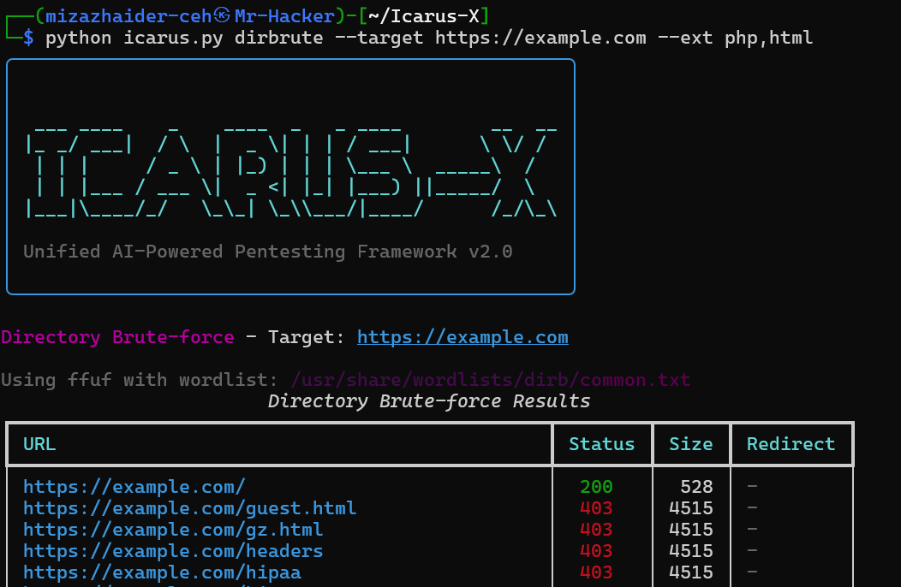
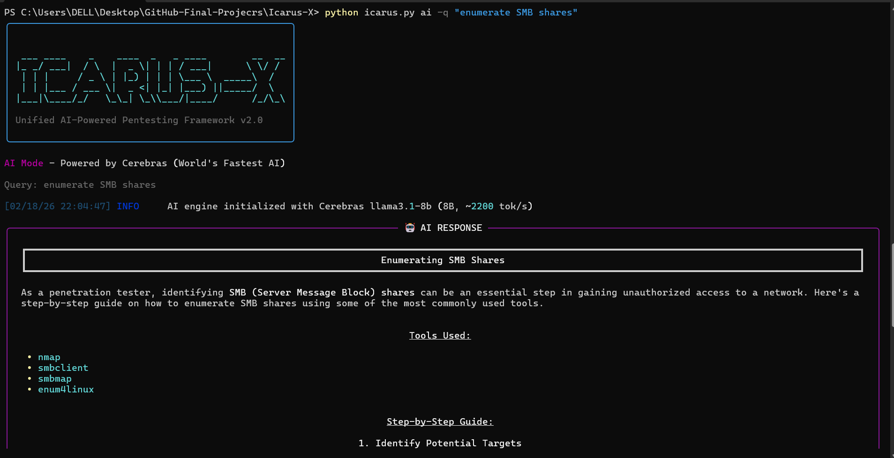

<div align="center">

# ✈️ ICARUS-X

### AI-Powered Penetration Testing Framework

```
 ___ ____    _    ____  _   _ ____        __  __
|_ _/ ___|  / \  |  _ \| | | / ___|      \ \/ /
 | | |     / _ \ | |_) | | | \___ \  _____\  / 
 | | |___ / ___ \|  _ <| |_| |___) ||_____/  \ 
|___|____/_/   \_\_| \_\___/|____/      /_/\_\
```

**Unified CLI • Async Architecture • AI-Powered Analysis**

[](https://www.python.org/)
[](LICENSE)
[](https://cerebras.ai/)
[](https://github.com/mizazhaider-ceh/Icarus-X)

<br>

[**Getting Started**](#-quick-start) · [**Features**](#-features) · [**Screenshots**](#-screenshots) · [**Documentation**](#-usage)

<br>


</div>

---

## 🎯 What is ICARUS-X?

**ICARUS-X** is a modern penetration testing framework that combines 13+ security tools into one unified CLI. Built with Python's async/await for blazing-fast performance and integrated with **Cerebras AI** (world's fastest inference at 3000+ tokens/sec) for intelligent command suggestions.

### Why Choose ICARUS-X?

| Feature | Description |
|:--------|:------------|
| ⚡ **Blazing Fast** | 500+ concurrent port scans, async DNS queries |
| 🤖 **AI-Powered** | Get attack suggestions, CVE explanations, bypass techniques |
| 🔧 **All-in-One** | Recon, vuln scanning, payloads, reporting in one tool |
| 📊 **Professional** | HTML/Markdown/JSON reports for clients |
| 🎨 **Modern UI** | Rich terminal with live progress, tables, colors |

---

## ✨ Features

<table>
<tr>
<td width="50%">

### 🔍 Reconnaissance
- Async port scanning (500+ concurrent)
- Subdomain enumeration
- HTTP service probing
- Technology fingerprinting
- WHOIS lookups

</td>
<td width="50%">

### 🔬 Vulnerability Assessment
- Nuclei CVE scanning
- Severity-based filtering
- Tag-based templates
- JSON export for automation

</td>
</tr>
<tr>
<td width="50%">

### 💉 Payload Generation
- Reverse shells (Bash, Python, PHP, NC)
- XSS payloads (alert, cookie steal)
- SQLi (union, boolean, time-based)
- Command injection
- Path traversal

</td>
<td width="50%">

### 🤖 AI Assistant
- Command suggestions for any goal
- CVE explanations & exploitation
- Bypass technique recommendations
- 5 model options (Llama, GPT-OSS, Qwen)

</td>
</tr>
</table>

### All 13 Modules

```
scout      → High-speed reconnaissance & port scanning
spider     → Web crawler with JS parsing
dirbrute   → Directory/file brute-forcing (ffuf/gobuster)
vuln       → Nuclei vulnerability scanning
tech       → Technology stack detection
payloads   → Attack payload generator
netmap     → Network discovery & mapping
ai         → AI-powered assistant
pentest    → Full automated workflow
report     → Professional report generation
tools      → External tool status checker
wordlists  → Wordlist browser & manager
runs       → Workflow run management
```

---

## 📸 Screenshots

<details open>
<summary><b>🔧 Tool Status Check</b></summary>
<br>


```bash
python icarus.py tools
```
</details>

<details>
<summary><b>🔍 Scout Reconnaissance</b></summary>
<br>


```bash
python icarus.py scout --target example.com --tech
```
</details>

<details>
<summary><b>📁 Directory Brute-forcing</b></summary>
<br>


```bash
python icarus.py dirbrute --target https://example.com --ext php,html
```
</details>

<details>
<summary><b>🤖 AI Assistant</b></summary>
<br>


```bash
python icarus.py ai --commands --goal "enumerate SMB shares"
```
</details>

<details>
<summary><b>💉 Payload Generator</b></summary>
<br>


```bash
python icarus.py payloads --list shells
```
</details>

---

## 🚀 Quick Start

### Prerequisites

- **Python 3.11+**
- **Linux** (Kali/Ubuntu), macOS, or Windows WSL2
- **External tools**: nmap, ffuf, nuclei (optional but recommended)

### Installation

```bash
# Clone the repository
git clone https://github.com/mizazhaider-ceh/Icarus-X.git
cd Icarus-X

# Install dependencies
pip install -r requirements.txt

# (Optional) Install external tools - Kali/Debian
sudo apt install nmap ffuf gobuster nuclei nikto sqlmap hydra whatweb

# Verify installation
python icarus.py tools
```

### AI Setup (Optional)

```bash
# Get free API key from https://cloud.cerebras.ai/
echo "CEREBRAS_API_KEY=your-key-here" > .env

# Test AI assistant
python icarus.py ai --query "how to enumerate Active Directory?"
```

---

## 💻 Usage

### Quick Reference

```bash
# Reconnaissance
python icarus.py scout -t example.com
python icarus.py scout -t example.com --ports 22,80,443 --tech

# Directory brute-forcing
python icarus.py dirbrute -t https://example.com
python icarus.py dirbrute -t https://example.com --ext php,html,js

# Vulnerability scanning
python icarus.py vuln -t https://example.com --severity critical,high

# Payloads
python icarus.py payloads --list shells
python icarus.py payloads --type bash --ip 10.10.14.5 --port 4444

# AI Assistant
python icarus.py ai --commands --goal "initial foothold on Linux"
python icarus.py ai --explain CVE-2024-1234

# Full pentest workflow
python icarus.py pentest -t example.com --workflow full
```

### Mass Target Scanning

```bash
# Create targets file
echo -e "192.168.1.0/24\nexample.com\n10.0.0.1-50" > targets.txt

# Scan all targets
python icarus.py scout --targets targets.txt
```

### AI Model Selection

```bash
# Available models (Cerebras - world's fastest inference)
python icarus.py ai --commands --goal "privesc" --model llama3.1-8b      # Fast
python icarus.py ai --commands --goal "privesc" --model llama-3.3-70b   # Balanced
python icarus.py ai --commands --goal "privesc" --model qwen-3-235b     # Most capable
```

---

## 🗂️ Project Structure

```
Icarus-X/
├── icarus.py              # Main CLI entry point (Typer)
├── icarus.toml            # Configuration
├── requirements.txt       # Python dependencies
│
├── core/                  # Core engine
│   ├── scanner.py         # Async reconnaissance
│   ├── workflow.py        # Pentest orchestration
│   ├── reporter.py        # Report generation
│   └── ai_engine.py       # Cerebras AI integration
│
├── modules/               # Feature modules
│   ├── dirbrute.py        # Directory brute-forcing
│   ├── nuclei.py          # CVE scanning
│   ├── techdetect.py      # Tech fingerprinting
│   ├── spider.py          # Web crawling
│   ├── netmap.py          # Network discovery
│   ├── payloads.py        # Payload generation
│   └── targets.py         # Mass target import
│
├── models/                # Pydantic data models
│   ├── target.py
│   ├── finding.py
│   └── workflow.py
│
└── utils/                 # Utilities
    ├── tools.py           # External tool checker
    ├── wordlists.py       # Wordlist manager
    ├── config.py          # Configuration loader
    └── logger.py          # Rich logging
```

---

## ⚙️ Configuration

Edit `icarus.toml` to customize:

```toml
[scanner]
port_timeout = 2.0
max_concurrent_ports = 500
default_ports = "21,22,80,443,445,3306,3389,8080"

[ai]
provider = "cerebras"
model = "llama3.1-8b"    # Options: llama3.1-8b, llama-3.3-70b, qwen-3-235b

[report]
output_dir = "reports"
```

---

## 🛠️ Required External Tools

| Tool | Purpose | Install |
|------|---------|---------|
| nmap | Port scanning | `apt install nmap` |
| ffuf | Web fuzzing | `apt install ffuf` |
| nuclei | CVE scanning | `apt install nuclei` |
| gobuster | Dir brute | `apt install gobuster` |
| nikto | Web scanner | `apt install nikto` |
| sqlmap | SQL injection | `apt install sqlmap` |

Check status: `python icarus.py tools`

---

## 🔒 Legal Disclaimer

> ⚠️ **ICARUS-X is designed for authorized security testing only.**

- Always obtain **written permission** before testing
- Understand your legal jurisdiction
- Use responsibly and ethically

Unauthorized access to computer systems is illegal.

---

## 📄 License

MIT License - See [LICENSE](LICENSE) for details.

---

<div align="center">

**ICARUS-X** · Built with Python, AsyncIO, Typer, Rich & Cerebras AI

*"Fly high, but not too close to the sun"* ☀️

[⬆ Back to Top](#-icarus-x)

</div>
